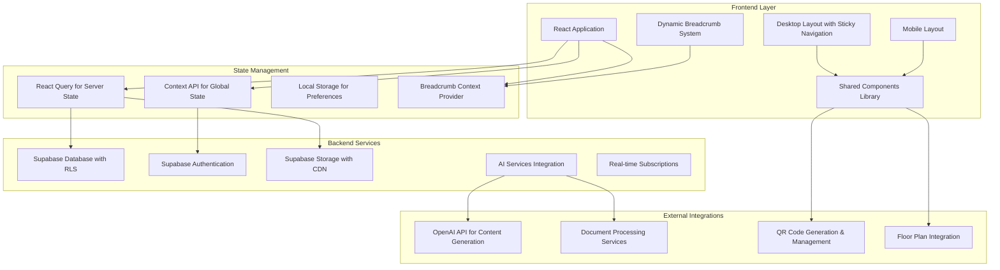
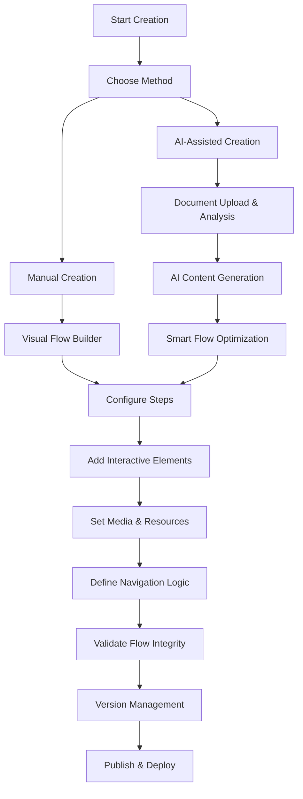
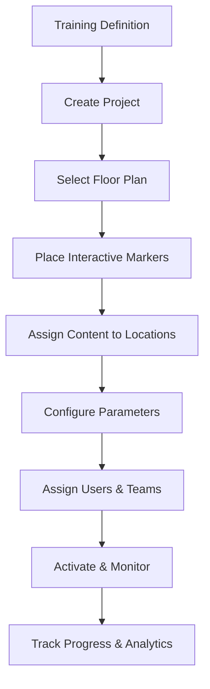
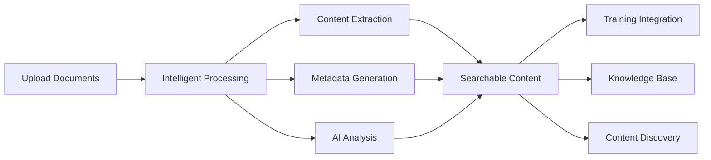
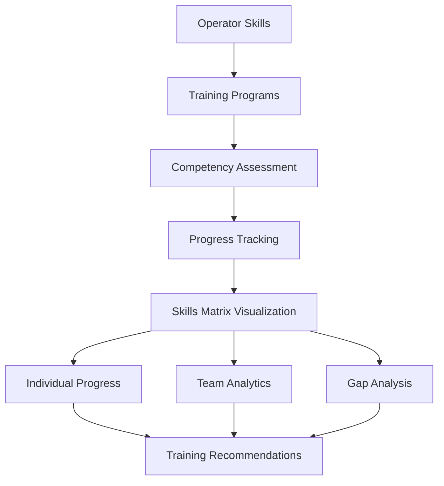
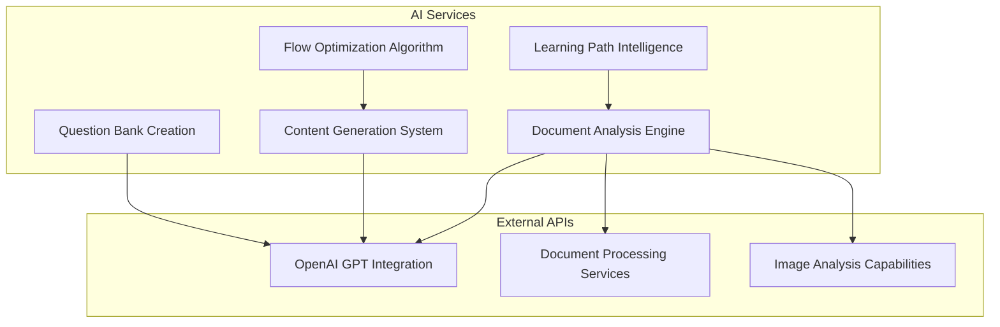
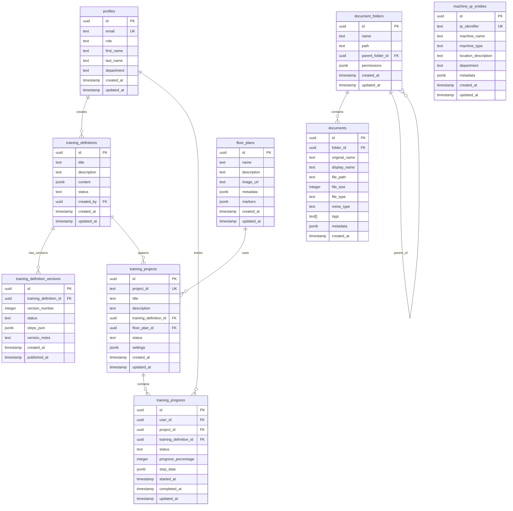
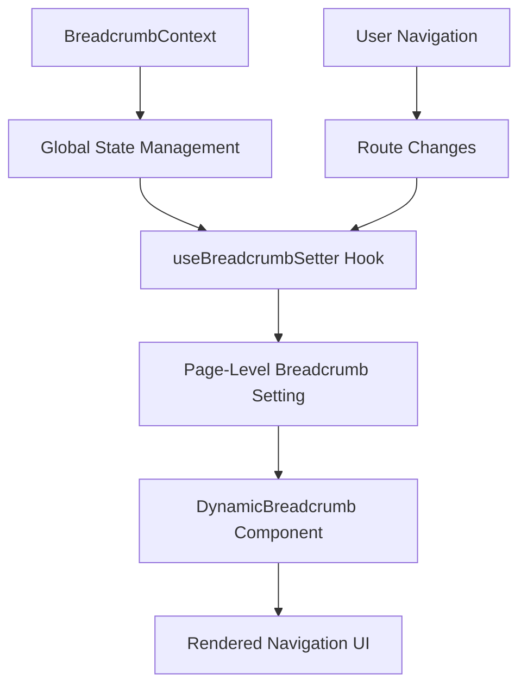
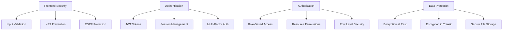

# OPPR Training Platform - Technical Documentation

## Table of Contents

1. [Executive Summary](#executive-summary)
2. [System Architecture](#system-architecture)
3. [Technology Stack](#technology-stack)
4. [Application Structure](#application-structure)
5. [Core Features](#core-features)
6. [Database Schema](#database-schema)
7. [Authentication & Authorization](#authentication--authorization)
8. [File Management](#file-management)
9. [AI Integration](#ai-integration)
10. [User Interface & Navigation](#user-interface--navigation)
11. [Development Setup](#development-setup)
12. [Deployment Guide](#deployment-guide)
13. [Security Considerations](#security-considerations)
14. [API Reference](#api-reference)
15. [Component Architecture](#component-architecture)
16. [Performance Considerations](#performance-considerations)
17. [Recent Updates & Improvements](#recent-updates--improvements)

---

## Executive Summary

The OPPR Training Platform is a comprehensive, enterprise-grade training management system designed for industrial and operational training scenarios. The platform enables organizations to create, manage, and deploy interactive training content with AI-assisted generation capabilities, providing a complete solution for modern workforce training needs.

### Key Value Propositions

- **AI-Powered Training Creation**: Automated generation of training flows from documents using advanced AI analysis
- **Visual Training Designer**: Intuitive drag-and-drop interface for creating complex training sequences
- **Project-Based Management**: Organized approach to training deployment with floor plan integration
- **Integrated Document Management**: Centralized storage and intelligent processing of training materials
- **QR Code Integration**: Seamless physical-digital bridge for equipment-based training scenarios
- **Comprehensive User Management**: Advanced role-based access control and skills tracking
- **Dynamic Navigation System**: Context-aware breadcrumb navigation and responsive layout design
- **Skills Matrix Management**: Visual competency tracking across operators and training programs
- **Real-time Collaboration**: Multi-user editing and progress tracking capabilities

---

## System Architecture



### Architecture Principles

1. **Component-Based Design**: Modular, reusable React components with clear separation of concerns
2. **Responsive Design**: Adaptive layouts optimized for both desktop and mobile experiences
3. **Progressive Enhancement**: Core functionality available with advanced features layered on top
4. **Security-First**: Multi-layered security with authentication, authorization, and data protection
5. **Real-time Capabilities**: Live updates and collaboration features across the platform
6. **Scalable Navigation**: Dynamic breadcrumb system that adapts to user context and application flow

---

## Technology Stack

### Frontend Technologies

- **React 18.3.1**: Core UI framework with hooks, functional components, and concurrent features
- **TypeScript**: Type-safe development with comprehensive type definitions and strict checking
- **Tailwind CSS**: Utility-first CSS framework with custom design system integration
- **Shadcn/UI**: High-quality component library built on Radix UI primitives with accessibility focus
- **Lucide React**: Comprehensive icon library for consistent visual design language
- **React Router DOM**: Client-side routing with dynamic navigation and breadcrumb integration
- **React Query (TanStack)**: Powerful server state management with intelligent caching and synchronization

### Backend & Infrastructure

- **Supabase**: Complete Backend-as-a-Service with real-time capabilities
- **PostgreSQL**: Advanced relational database with JSON support and full-text search
- **Row Level Security (RLS)**: Database-level authorization with fine-grained access control
- **Real-time Subscriptions**: Live data synchronization across all connected clients
- **Edge Functions**: Serverless compute for custom business logic and integrations

### Development & Build Tools

- **Vite**: Lightning-fast build tool with hot module replacement and optimized bundling
- **ESLint**: Comprehensive code linting with custom rules for consistency and quality
- **Bun**: Modern package manager and runtime with improved performance
- **TypeScript Compiler**: Static type checking with strict configuration

---

## Application Structure

```mermaid
graph LR
    subgraph "src/"
        A[components/] --> A1[desktop/]
        A --> A2[ui/]
        A --> A3[mobile/]
        A1 --> A4[DynamicBreadcrumb.tsx]
        A1 --> A5[DesktopLayout.tsx]
        
        B[pages/] --> B1[desktop/]
        B --> B2[mobile/]
        B1 --> B3[TrainingProjects.tsx]
        B1 --> B4[SkillsMatrix.tsx]
        B1 --> B5[Documentation.tsx]
        
        C[hooks/] --> C1[useTrainingDefinition.ts]
        C --> C2[useAIFlowGeneration.ts]
        C --> C3[useBreadcrumbSetter.ts]
        C --> C4[useSkillsMatrix.ts]
        
        D[contexts/] --> D1[AuthContext.tsx]
        D --> D2[AISettingsContext.tsx]
        D --> D3[BreadcrumbContext.tsx]
        
        E[services/] --> E1[aiFlowGenerationService.ts]
        E --> E2[trainingDefinitionService.ts]
        E --> E3[skillsMatrixService.ts]
        
        F[types/] --> F1[training-definitions.ts]
        F --> F2[training-projects.ts]
        F --> F3[machine-qr.ts]
    end
```



### Directory Structure Explanation

- **components/**: Organized component library with platform-specific implementations
  - **desktop/**: Desktop-optimized components with sticky navigation and advanced layouts
  - **ui/**: Reusable Shadcn/UI components with consistent theming
  - **mobile/**: Mobile-optimized components for touch interfaces
- **pages/**: Route-level components with integrated breadcrumb management
- **hooks/**: Custom React hooks for business logic, state management, and UI interactions
- **contexts/**: React context providers for global state and cross-component communication
- **services/**: API services, external integrations, and business logic layer
- **types/**: Comprehensive TypeScript definitions for type safety and developer experience

---

## Core Features

### 1. Training Definition Builder

The training definition builder is the flagship feature, providing a comprehensive visual editor for creating interactive training flows with AI assistance.



**Key Components:**
- `TrainingDefinitionBuilderMinimal`: Streamlined builder interface with enhanced UX
- `FlowCanvas`: Advanced visual flow editor with drag-and-drop functionality
- `BlockPalette`: Comprehensive library of step types and interactive components
- `AIFlowGenerator`: Intelligent content generation with context awareness
- `VersionManagement`: Complete version control with rollback capabilities

### 2. Training Projects & Floor Plan Integration

Projects represent real-world deployments of training definitions with spatial context and user assignment.



**Advanced Features:**
- Interactive floor plan editor with marker placement
- QR code integration for physical-digital training bridges
- Real-time progress tracking and analytics
- Multi-user collaboration with role-based permissions
- Automated content updates and synchronization

### 3. Document Management (Oppr Docs)

Enterprise-grade document management system with intelligent processing and AI integration.



**Capabilities:**
- Multi-format support (PDF, DOC, images, presentations)
- Advanced OCR and content extraction
- Hierarchical folder organization with permissions
- Bulk upload with progress tracking
- AI-powered content analysis and tagging
- Full-text search with intelligent filtering

### 4. Skills Matrix Management

Comprehensive competency tracking system with visual analytics and progress monitoring.



**Key Features:**
- Interactive skills matrix with filtering and sorting
- Real-time progress updates and status tracking
- Comprehensive export capabilities for reporting
- Department and role-based analytics
- Automated competency gap identification

### 5. AI Integration & Content Generation

Advanced AI capabilities for automated content creation and intelligent training optimization.



**AI Capabilities:**
1. **Intelligent Document Analysis**
   - Automated content summarization and topic extraction
   - Complexity assessment and difficulty grading
   - Key concept identification and relationship mapping

2. **Smart Training Generation**
   - Automatic step creation with logical flow
   - Context-aware question generation
   - Assessment design with multiple question types
   - Progress tracking configuration

3. **Content Optimization**
   - Learning path optimization based on user data
   - Difficulty progression with adaptive learning
   - Engagement enhancement through interactive elements
   - Personalization recommendations

---

## Database Schema



### Key Schema Features

1. **User Management**: Comprehensive profile system with role-based access
2. **Content Versioning**: Full version control for training definitions
3. **Project Hierarchy**: Clear relationship between definitions, projects, and execution
4. **Document Organization**: Hierarchical folder structure with metadata support
5. **Physical Integration**: Floor plans and QR entities for spatial training
6. **Progress Tracking**: Detailed analytics and completion monitoring
7. **Audit Trail**: Complete timestamping and change tracking

---

## User Interface & Navigation

### Dynamic Breadcrumb System

The platform features a sophisticated breadcrumb navigation system that provides context-aware navigation across all pages.



**Breadcrumb Features:**
- Automatic context detection based on current route
- Support for nested navigation and dynamic parameters
- Integration with training project tabs and editor states
- Accessibility-compliant markup and keyboard navigation
- Responsive design for mobile and desktop interfaces

### Sticky Navigation Layout

The desktop layout employs a fixed sidebar and sticky header design for optimal user experience:

**Layout Structure:**
- **Fixed Sidebar**: Persistent navigation that remains visible during content scrolling
- **Sticky Header**: Top navigation bar with breadcrumbs that stays in view
- **Scrollable Content**: Main content area with proper overflow handling
- **Z-Index Management**: Proper layering to ensure navigation elements stay accessible

### Responsive Design Principles

- **Desktop-First**: Optimized for desktop workflows with advanced features
- **Mobile Adaptive**: Responsive breakpoints with touch-optimized interactions
- **Consistent Theming**: Unified design system across all components
- **Accessibility**: WCAG 2.1 AA compliance with keyboard navigation support

---

## Development Setup

### Prerequisites

- **Node.js 18+** or **Bun runtime** for modern JavaScript execution
- **Git** for version control and collaboration
- **Supabase account** with project setup
- **OpenAI API key** for AI integration features

### Installation Steps

```bash
# Clone repository
git clone <repository-url>
cd oppr-training-platform

# Install dependencies with Bun (recommended)
bun install

# Or with npm
npm install

# Set up environment variables
cp .env.example .env.local
# Edit .env.local with your configuration

# Start development server
bun dev

# Or with npm
npm run dev
```

### Environment Configuration

```env
# Supabase Configuration
VITE_SUPABASE_URL=your_supabase_project_url
VITE_SUPABASE_ANON_KEY=your_supabase_anon_key

# AI Integration
VITE_OPENAI_API_KEY=your_openai_api_key

# Optional: Custom API endpoints
VITE_API_BASE_URL=your_custom_api_url
```

### Development Workflow

1. **Feature Development**: Create feature branches with descriptive names
2. **Code Quality**: Automated ESLint checking and TypeScript validation
3. **Component Testing**: Isolated component development with Storybook
4. **Integration Testing**: Full workflow validation across features
5. **Performance Monitoring**: Bundle analysis and runtime optimization
6. **Documentation**: Comprehensive code documentation and API references

---

## Security Considerations

### Multi-Layer Security Model



### Security Features

1. **Authentication & Authorization**
   - JWT-based authentication with automatic refresh
   - Role-based access control (Admin, Manager, Operator, Viewer)
   - Resource-level permissions with granular control
   - Session timeout and security monitoring

2. **Data Protection**
   - End-to-end encryption for sensitive data
   - Secure file upload with virus scanning
   - Database encryption with Supabase security
   - GDPR compliance with data retention policies

3. **Application Security**
   - Input sanitization and validation
   - XSS and CSRF protection
   - Content Security Policy (CSP) implementation
   - Regular security audits and dependency updates

---

## Recent Updates & Improvements

### Navigation & User Experience Enhancements

**Dynamic Breadcrumb System (Latest)**
- Implemented context-aware breadcrumb navigation across all pages
- Created reusable `BreadcrumbContext` for state management
- Added `useBreadcrumbSetter` hook for easy breadcrumb configuration
- Integrated Shadcn breadcrumb components with custom styling

**Sticky Layout Improvements**
- Fixed sidebar positioning to remain visible during scrolling
- Implemented sticky header with proper z-index management
- Optimized content scrolling with overflow handling
- Enhanced responsive behavior across different screen sizes

**Page-Level Breadcrumb Integration**
- Training Projects: Dynamic breadcrumbs with project context
- Training Definitions: Version-aware navigation paths
- Skills Matrix: Department and filter-based breadcrumbs
- Documentation: Section-aware navigation
- Machine Registry: Equipment type and location context
- Floor Plans: Project integration breadcrumbs
- User Management: Role and department context

### Skills Matrix Enhancements

**Advanced Analytics & Visualization**
- Interactive skills matrix with real-time filtering
- Comprehensive progress tracking with status indicators
- Export functionality for detailed reporting
- Department-based analytics and gap analysis
- Integration with training project assignments

**Performance Optimizations**
- Efficient data loading with pagination
- Smart caching for frequently accessed data
- Optimized rendering for large datasets
- Real-time updates without full page refreshes

### AI Integration Improvements

**Enhanced Document Processing**
- Improved content extraction accuracy
- Advanced metadata generation
- Better support for complex document formats
- Intelligent tagging and categorization

**Smarter Training Generation**
- Context-aware content creation
- Improved question generation algorithms
- Better learning path optimization
- Enhanced user experience flow

### Technical Infrastructure Updates

**Performance Enhancements**
- Optimized bundle splitting for faster loading
- Improved React Query caching strategies
- Enhanced error boundaries and recovery
- Better memory management for large applications

**Developer Experience**
- Comprehensive TypeScript coverage
- Improved component organization
- Better documentation and code comments
- Enhanced debugging capabilities

---

## Future Roadmap

### Planned Features (Next 6 Months)

1. **Advanced Mobile Application**
   - Native mobile app for iOS and Android
   - Offline training capabilities
   - Push notifications for training reminders
   - Camera integration for QR scanning

2. **Enhanced Analytics Dashboard**
   - Real-time learning analytics
   - Predictive performance modeling
   - Custom report builder
   - Integration with external BI tools

3. **Advanced AI Capabilities**
   - Natural language training creation
   - Automated content updates
   - Personalized learning recommendations
   - Intelligent tutoring system

4. **Enterprise Integrations**
   - Single Sign-On (SSO) support
   - LDAP/Active Directory integration
   - REST API for third-party systems
   - Webhook support for external notifications

### Long-term Vision (12+ Months)

1. **Microservices Architecture**
   - Service decomposition for better scalability
   - Independent deployment capabilities
   - Enhanced fault tolerance
   - Better resource optimization

2. **Advanced Collaboration Features**
   - Real-time multi-user editing
   - Video conferencing integration
   - Collaborative training sessions
   - Social learning features

3. **Machine Learning Platform**
   - Custom ML model training
   - Automated content optimization
   - Predictive analytics
   - Behavioral pattern recognition

4. **Global Deployment & Localization**
   - Multi-region deployment
   - Internationalization support
   - Currency and timezone handling
   - Compliance with regional regulations

---

## Performance Considerations

### Frontend Optimization

**Bundle Management**
- Code splitting by route and feature
- Dynamic imports for large components
- Tree shaking for unused code elimination
- Optimized asset loading with lazy loading

**Runtime Performance**
- React.memo for expensive component renders
- useMemo and useCallback for computation optimization
- Virtual scrolling for large data sets
- Debounced search and filtering operations

**Network Optimization**
- React Query for intelligent API caching
- Request batching and deduplication
- Compression for file uploads
- CDN utilization for static assets

### Backend Performance

**Database Optimization**
- Efficient PostgreSQL queries with proper indexing
- Connection pooling for better resource utilization
- Query result caching with intelligent invalidation
- Optimized row-level security policies

**Storage & CDN**
- Global content delivery network
- Image optimization and compression
- Efficient file storage strategies
- Bandwidth optimization techniques

---

## Monitoring & Analytics

### Application Monitoring

**Performance Metrics**
- Real-time performance monitoring
- Core Web Vitals tracking
- Bundle size analysis
- User interaction analytics

**Error Tracking**
- Comprehensive error boundary implementation
- Automatic error reporting and alerting
- Performance regression detection
- User experience monitoring

### Business Intelligence

**Training Analytics**
- Completion rate tracking
- Learning effectiveness analysis
- User engagement metrics
- Content performance insights

**System Usage**
- Feature adoption rates
- User behavior patterns
- Resource utilization analysis
- Scalability planning data

---

## Conclusion

The OPPR Training Platform represents a cutting-edge solution for modern industrial training management. With its recent enhancements in navigation, user experience, and AI capabilities, the platform provides a comprehensive, scalable foundation for organizational training needs.

The implementation of dynamic breadcrumbs, sticky navigation, and enhanced skills matrix functionality demonstrates the platform's commitment to user experience excellence. Combined with robust AI integration, comprehensive document management, and advanced analytics capabilities, OPPR Training Platform stands as a leader in the training technology space.

The platform's modular architecture, comprehensive security model, and continuous improvement approach ensure it will continue to evolve and adapt to changing business requirements, providing long-term value for organizations seeking to enhance their training effectiveness and operational excellence.

**Key Success Factors:**
- User-centric design with intuitive navigation
- AI-powered content generation reducing manual effort
- Comprehensive analytics for data-driven decisions
- Scalable architecture supporting growth
- Strong security foundation ensuring data protection
- Continuous improvement based on user feedback

---

*Document Version: 2.0*  
*Last Updated: January 2025*  
*Maintained by: OPPR Development Team*

*This documentation reflects the current state of the OPPR Training Platform including all recent updates, improvements, and planned enhancements. For the most current information, please refer to the development team or check the project repository.*
