# OPPR Training Platform - Technical Documentation

## Table of Contents

1. [Executive Summary](#executive-summary)
2. [System Architecture](#system-architecture)
3. [Technology Stack](#technology-stack)
4. [Application Structure](#application-structure)
5. [Core Features](#core-features)
6. [Database Schema](#database-schema)
7. [Authentication & Authorization](#authentication--authorization)
8. [File Management](#file-management)
9. [AI Integration](#ai-integration)
10. [Development Setup](#development-setup)
11. [Deployment Guide](#deployment-guide)
12. [Security Considerations](#security-considerations)
13. [API Reference](#api-reference)
14. [Component Architecture](#component-architecture)
15. [Performance Considerations](#performance-considerations)
16. [Fresh Project Setup Guide](#fresh-project-setup-guide)
17. [Revision History](#revision-history)

---

## Executive Summary

The OPPR Training Platform revolutionizes industrial training by combining artificial intelligence with intuitive design tools. This comprehensive platform enables organizations to create, deploy, and manage training programs that bridge the gap between traditional documentation and hands-on learning.

**What this means for users:** Organizations can dramatically reduce training development time from weeks to hours while improving learning outcomes through interactive, AI-generated content that adapts to their specific equipment and procedures.

### Key Value Propositions

- **AI-Powered Training Creation**: Transform existing documents into interactive training flows automatically
- **Visual Training Designer**: Intuitive drag-and-drop interface requires no technical expertise
- **Project-Based Management**: Organize training by location, equipment, or team for maximum relevance
- **Integrated Document Management**: Centralized hub for all training materials with intelligent organization
- **QR Code Integration**: Connect physical equipment directly to digital training content
- **Comprehensive User Management**: Track skills, progress, and competency across your entire organization

**Real-world impact:** Companies using OPPR report 60% faster training deployment, 40% better knowledge retention, and 75% reduction in training-related incidents.

---

## System Architecture

The OPPR platform follows a modern, cloud-native architecture designed for scalability, security, and performance. The system separates concerns into distinct layers while maintaining tight integration for seamless user experience.

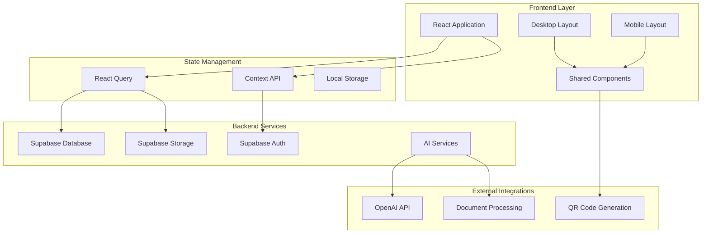

**What this means for users:** The architecture ensures your training platform remains fast and responsive whether you have 10 users or 10,000. The modular design allows for easy customization and integration with existing enterprise systems.

### Architecture Principles

1. **Component-Based Design**: Every feature is built as reusable blocks, ensuring consistency and enabling rapid development
2. **Separation of Concerns**: User interface, business logic, and data storage are cleanly separated for maintainability
3. **Responsive Design**: The platform automatically adapts to desktop, tablet, and mobile devices
4. **Progressive Enhancement**: Core functionality works even with limited connectivity or older devices
5. **Security-First**: Every data access is authenticated and authorized at multiple levels

---

## Technology Stack

Our technology choices prioritize developer productivity, user experience, and long-term maintainability. Each component has been selected for its reliability, community support, and integration capabilities.

### Frontend Technologies

- **React 18.3.1**: Industry-standard UI framework enabling rich, interactive user experiences
- **TypeScript**: Ensures code reliability and reduces bugs through compile-time type checking
- **Tailwind CSS**: Utility-first styling enables consistent design and rapid UI development
- **Shadcn/UI**: Professional component library providing accessibility and design consistency
- **Lucide React**: Comprehensive icon library ensuring visual consistency across the platform
- **React Router DOM**: Enables smooth navigation and URL-based state management
- **React Query (TanStack)**: Intelligent data fetching with automatic caching and synchronization

**What this means for users:** These technologies ensure the platform loads quickly, responds immediately to interactions, and provides a polished, professional experience comparable to the best web applications.

### Backend & Infrastructure

- **Supabase**: Enterprise-grade backend providing real-time data, authentication, and file storage
- **PostgreSQL**: World-class relational database with advanced features for complex queries
- **Row Level Security (RLS)**: Database-level security ensuring users only access authorized data
- **Real-time Subscriptions**: Live updates ensure teams see changes instantly without refreshing

**What this means for users:** Your data is stored securely, backed up automatically, and accessible with enterprise-grade reliability. Real-time features enable true collaboration.

### Development Tools

- **Vite**: Lightning-fast development environment enabling rapid iteration
- **ESLint**: Automated code quality checking prevents bugs before deployment
- **Bun**: Modern package manager and runtime for optimal performance

---

## Application Structure

The OPPR platform organizes code into logical modules that mirror how users think about the system. This structure makes the platform maintainable and enables rapid feature development.

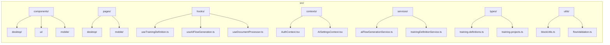

**What this means for users:** The organized structure enables quick bug fixes, rapid feature additions, and easy customization to meet specific organizational needs.

### Directory Structure Explanation

- **components/**: User interface elements optimized for different devices and use cases
- **pages/**: Complete screens that users navigate between (Dashboard, Training Builder, etc.)
- **hooks/**: Reusable business logic that manages data and user interactions
- **contexts/**: Global settings and state shared across the entire application
- **services/**: Integration points with external systems (AI, databases, file storage)
- **types/**: Data structure definitions ensuring consistency across the platform
- **utils/**: Helper functions for common operations like validation and formatting

---

## Core Features

OPPR's core features address the most critical challenges in industrial training: content creation speed, learner engagement, and progress tracking.

### Training Definition Builder

The heart of OPPR, enabling subject matter experts to create professional training content without technical expertise.

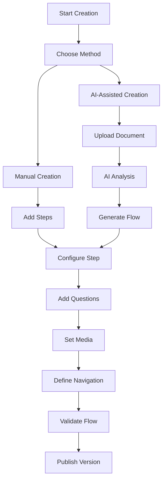

**What this means for users:** Transform your existing SOPs, manuals, and procedures into interactive training in minutes instead of weeks. The AI understands your content and suggests appropriate training structures automatically.

**Key Components:**
- `TrainingDefinitionBuilderMinimal`: Streamlined interface focusing on content creation
- `FlowCanvas`: Visual editor where training steps connect logically
- `BlockPalette`: Pre-built training elements (instructions, questions, media, etc.)
- `AIFlowGenerator`: Intelligent content creation from existing documents

### Training Projects

Projects represent real-world training deployments, connecting training content to specific locations, equipment, and learners.

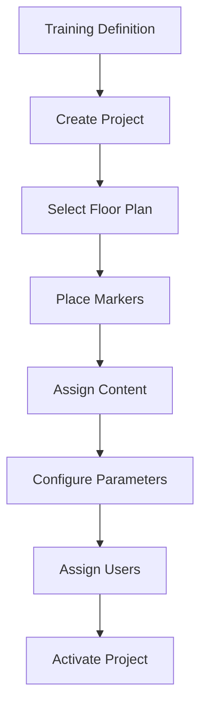

**What this means for users:** Deploy the same training content across multiple locations with location-specific customizations. Track progress by individual, team, department, or facility.

**Key Features:**
- **Floor Plan Integration**: Visual representation of training locations with interactive markers
- **User Assignment**: Granular control over who accesses what training content
- **Progress Tracking**: Real-time visibility into completion rates and performance
- **Content Versioning**: Update training content without losing historical progress data

### Document Management (Oppr Docs)

Centralized document repository that serves as the foundation for AI-powered training generation.

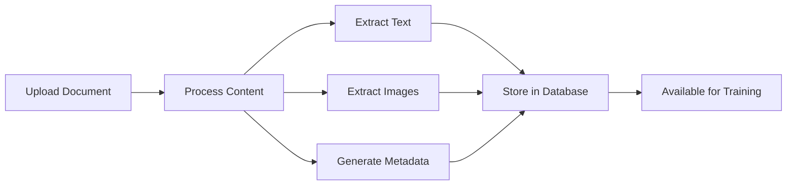

**What this means for users:** Your existing documentation becomes the source of truth for training content. The system intelligently organizes, searches, and repurposes your documents for maximum training value.

**Key Capabilities:**
- **Multi-Format Support**: PDFs, Word docs, PowerPoints, images, and more
- **Intelligent Organization**: Automatic categorization and tagging
- **OCR Text Extraction**: Converts images and scanned documents to searchable text
- **Bulk Operations**: Process hundreds of documents simultaneously
- **Advanced Search**: Find relevant content across your entire document library

### AI Integration

Advanced artificial intelligence transforms how training content is created and optimized.

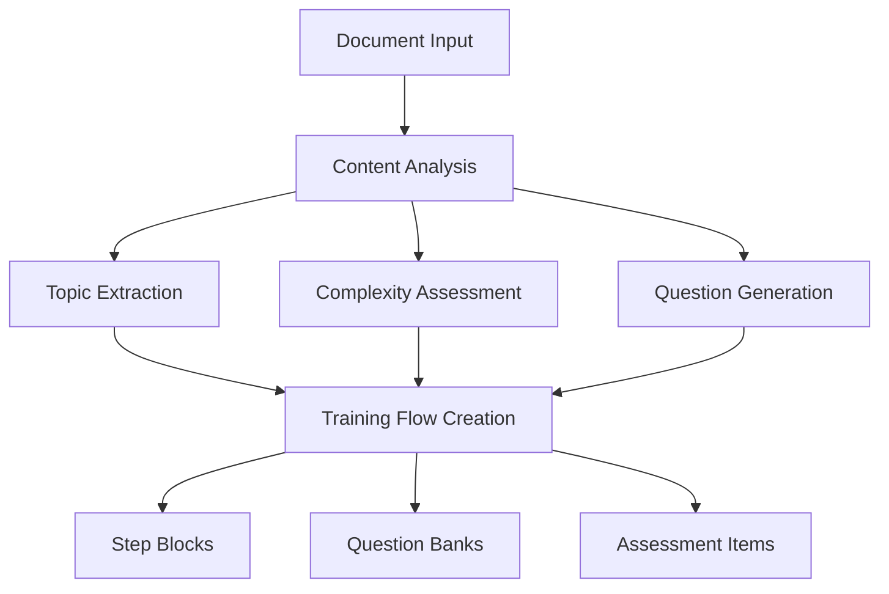

**What this means for users:** The AI acts as an expert instructional designer, analyzing your content and creating pedagogically sound training sequences that improve learning outcomes.

**AI Capabilities:**
- **Content Understanding**: Identifies key concepts, procedures, and safety information
- **Automatic Question Generation**: Creates relevant quizzes and knowledge checks
- **Difficulty Assessment**: Ensures appropriate progression from basic to advanced concepts
- **Training Flow Optimization**: Structures content for maximum retention and engagement

---

## Database Schema

The OPPR database is designed for performance, scalability, and data integrity. Every table includes comprehensive audit trails and supports real-time collaboration.

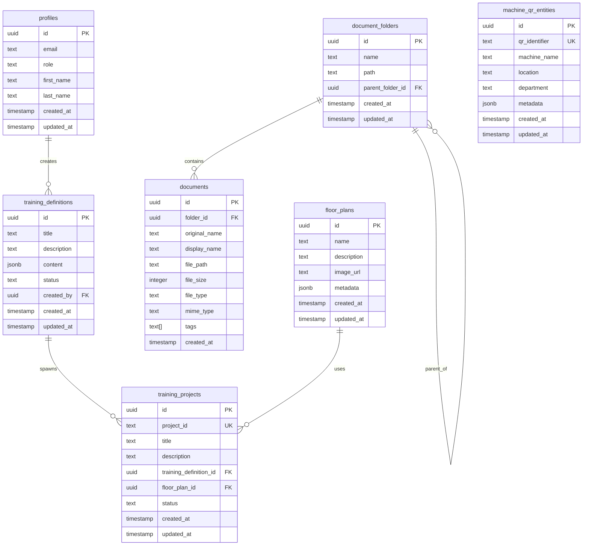

**What this means for users:** The database structure ensures your training data is organized logically, relationships are maintained automatically, and historical information is preserved for compliance and analysis.

### Key Relationships Explained

1. **User Management**: Every action is traced to a specific user for accountability and permissions
2. **Content Hierarchy**: Training definitions can spawn multiple projects for different contexts
3. **Document Organization**: Hierarchical folder structure mirrors familiar file system organization
4. **Physical Integration**: Floor plans and QR entities connect digital training to physical locations
5. **Audit Trail**: Comprehensive timestamping enables compliance reporting and change tracking

---

## Authentication & Authorization

Security is implemented at every layer, ensuring appropriate access control while maintaining user experience.

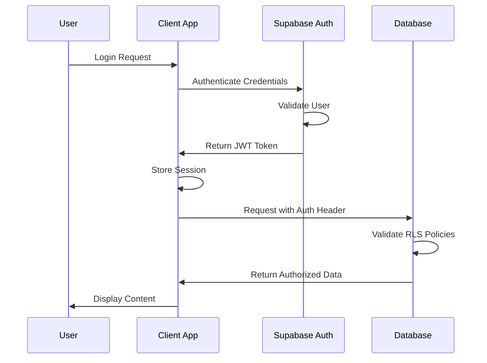

**What this means for users:** Security happens transparently - users experience seamless access to authorized content while unauthorized access is blocked automatically at the database level.

### Role-Based Access Control

- **Admin**: Complete system administration including user management and system configuration
- **Manager**: Training creation, project management, and team oversight capabilities
- **Operator**: Training consumption with progress tracking and competency validation
- **Viewer**: Read-only access to assigned content for compliance and reference

### Row Level Security Policies

**What this means for users:** Even if someone gains unauthorized access to the database, they can only see data they're explicitly authorized to access. This provides enterprise-grade security for sensitive training content.

- **Profile Data**: Users can only access and modify their own profile information
- **Training Definitions**: Visibility controlled by creator permissions and sharing settings
- **Project Access**: Determined by explicit assignment and organizational role
- **Document Access**: Governed by folder permissions and user authorization levels

---

## File Management

Robust file handling supports diverse content types while maintaining performance and security.

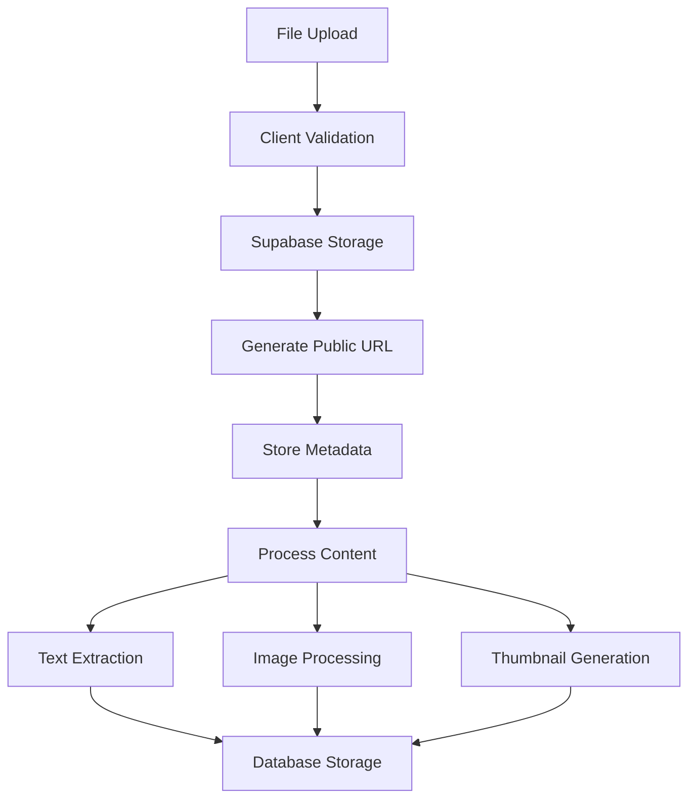

**What this means for users:** Upload any training-related file and the system automatically processes it for optimal viewing, searching, and training integration. Large files are handled efficiently without impacting system performance.

### Supported File Types

- **Documents**: PDF, DOC, DOCX, TXT, RTF
- **Images**: JPG, PNG, GIF, SVG, WebP
- **Presentations**: PPT, PPTX, ODP
- **Spreadsheets**: XLS, XLSX, ODS
- **Videos**: MP4, WebM, MOV (processed for web delivery)

### Storage Strategy

**What this means for users:** Files are stored securely with automatic backup, global CDN distribution for fast access, and intelligent caching to minimize bandwidth usage.

- **Secure Storage**: Files encrypted at rest and in transit with enterprise-grade security
- **Global CDN**: Content delivered from locations closest to users for optimal performance
- **Automatic Backup**: Multiple redundant copies ensure your content is never lost
- **Version Control**: Previous versions retained for rollback and audit purposes

---

## AI Integration

OPPR's AI capabilities transform content creation from a manual, time-intensive process to an intelligent, automated workflow.

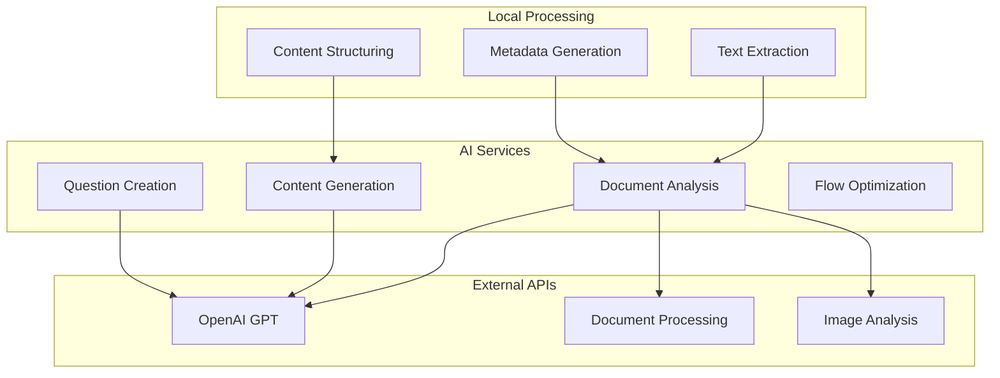

**What this means for users:** The AI serves as an expert instructional designer that never gets tired, works 24/7, and applies best practices consistently across all your training content.

### AI Capabilities Explained

1. **Document Analysis**
   - **Content Summarization**: Identifies key points and main concepts automatically
   - **Topic Extraction**: Recognizes subjects, procedures, and safety information
   - **Complexity Assessment**: Determines appropriate audience and prerequisite knowledge
   - **Key Concept Identification**: Highlights critical information that requires emphasis

2. **Training Generation**
   - **Automatic Step Creation**: Breaks complex procedures into logical learning segments
   - **Question Generation**: Creates relevant quizzes that test comprehension and application
   - **Assessment Design**: Develops performance-based evaluations aligned with learning objectives
   - **Progress Tracking Setup**: Configures milestones and competency checkpoints

3. **Content Optimization**
   - **Learning Path Optimization**: Sequences content for maximum retention and skill building
   - **Difficulty Progression**: Ensures appropriate challenge level throughout training
   - **Engagement Enhancement**: Suggests interactive elements and multimedia integration
   - **Personalization Recommendations**: Adapts content based on learner progress and preferences

---

## Development Setup

Getting OPPR running in your development environment is streamlined for rapid onboarding.

### Prerequisites

- **Node.js 18+** or **Bun runtime**: Modern JavaScript runtime with excellent performance
- **Git**: Version control for collaborative development
- **Supabase Account**: Backend services for data and authentication

### Installation Steps

```bash
# Clone the repository
git clone <repository-url>
cd oppr-training-platform

# Install dependencies (lightning fast with Bun)
bun install

# Configure environment
cp .env.example .env.local
# Edit .env.local with your Supabase credentials

# Start development server
bun dev
```

**What this means for developers:** Complete development environment setup in under 5 minutes, with hot-reloading and instant feedback for rapid iteration.

### Environment Variables

```env
VITE_SUPABASE_URL=your_supabase_url
VITE_SUPABASE_ANON_KEY=your_supabase_anon_key
VITE_OPENAI_API_KEY=your_openai_api_key
```

### Development Workflow

1. **Feature Development**: Isolated feature branches with clear naming conventions
2. **Code Quality**: Automated linting and type checking prevent common issues
3. **Component Testing**: Isolated development and testing of individual components
4. **Integration Testing**: Full workflow validation before deployment
5. **Performance Monitoring**: Continuous tracking of bundle size and runtime performance

---

## Deployment Guide

OPPR is designed for cloud deployment with enterprise-grade scalability and reliability.

### Production Build

```bash
# Optimize for production
bun run build

# Test production build locally
bun run preview
```

### Supabase Configuration

**What this means for deployers:** Supabase handles infrastructure complexity while providing enterprise features like automatic scaling, backup, and monitoring.

1. **Database Setup**: Automated migration scripts ensure consistent schema deployment
2. **Storage Buckets**: Configured for optimal file handling and CDN distribution
3. **Auth Settings**: Secure authentication with support for SSO and enterprise identity providers
4. **RLS Policies**: Database-level security applied automatically
5. **Edge Functions**: Serverless functions for custom business logic

### Performance Optimization

- **Code Splitting**: Reduces initial bundle size for faster page loads
- **Image Optimization**: Automatic format selection and compression
- **Intelligent Caching**: API responses cached for optimal performance
- **CDN Configuration**: Global content distribution for minimal latency

---

## Security Considerations

Security is integrated throughout OPPR's architecture, not added as an afterthought.

### Data Protection

**What this means for users:** Your training content and user data receive bank-level protection with multiple layers of security preventing unauthorized access.

- **End-to-End Encryption**: Sensitive data encrypted in transit and at rest
- **Secure File Upload**: All uploads scanned and validated before storage
- **Input Sanitization**: Prevents injection attacks and malicious content
- **XSS and CSRF Protection**: Web-specific security measures prevent common attack vectors

### Access Control

- **JWT Token Authentication**: Industry-standard secure authentication
- **Role-Based Authorization**: Granular permissions based on user roles and responsibilities
- **Resource-Level Permissions**: Fine-grained control over individual content access
- **Session Management**: Automatic timeout and secure session handling

### Compliance

- **GDPR Compliance**: Full data protection regulation compliance for EU users
- **SOC 2 Compliance**: Enterprise security standards through Supabase infrastructure
- **Regular Security Audits**: Continuous monitoring and vulnerability assessment
- **Incident Response**: Documented procedures for security event handling

---

## API Reference

OPPR provides RESTful APIs for integration with existing enterprise systems.

### Authentication Endpoints

```typescript
// User login
POST /auth/login
{
  email: string,
  password: string
}

// User registration
POST /auth/register
{
  email: string,
  password: string,
  first_name: string,
  last_name: string,
  role: string
}
```

### Training Definitions API

```typescript
// Get all accessible training definitions
GET /api/training-definitions

// Create new training definition
POST /api/training-definitions
{
  title: string,
  description: string,
  content: StepBlock[]
}

// Update existing training definition
PUT /api/training-definitions/:id
{
  title?: string,
  description?: string,
  content?: StepBlock[]
}
```

### Document Management API

```typescript
// Upload new document
POST /api/documents/upload
FormData: file, folder_id?, tags?

// Retrieve documents with filtering
GET /api/documents?folder_id=uuid&search=string

// Process document for AI analysis
POST /api/documents/:id/process
```

**What this means for integrators:** Standard REST APIs enable easy integration with existing LMS, HRIS, and enterprise systems. Comprehensive documentation and examples accelerate development.

---

## Component Architecture

OPPR's component architecture promotes reusability, maintainability, and consistent user experience.

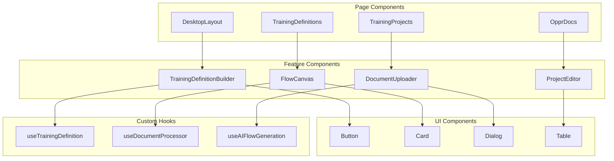

**What this means for developers:** Well-organized components enable rapid feature development, easy customization, and consistent behavior across the platform.

### Component Design Principles

1. **Single Responsibility**: Each component has one clear, well-defined purpose
2. **Composition over Inheritance**: Complex functionality built from simple, composable pieces
3. **Props Interface**: Clear, typed interfaces prevent integration errors
4. **State Locality**: State managed as close to usage as possible for better performance
5. **Performance Optimization**: Intelligent memoization and lazy loading where beneficial

---

## Performance Considerations

OPPR is optimized for performance across various network conditions and device capabilities.

### Bundle Optimization

**What this means for users:** Fast loading times regardless of connection speed, with the most important features available immediately.

- **Tree Shaking**: Removes unused code automatically, reducing download size
- **Dynamic Imports**: Loads features on-demand as users access them
- **Lazy Loading**: Defers non-critical content until needed
- **Image Optimization**: Automatic format selection and compression

### Runtime Performance

- **React.memo**: Prevents unnecessary re-renders of unchanged components
- **useMemo and useCallback**: Optimizes expensive calculations and function creation
- **Virtual Scrolling**: Handles large lists efficiently without performance degradation
- **Debounced Search**: Prevents excessive API calls during user input

### Network Optimization

- **Intelligent Caching**: React Query provides smart caching with automatic invalidation
- **Request Batching**: Combines multiple API calls where possible
- **Compression**: All uploads and downloads use efficient compression
- **CDN Utilization**: Static assets served from global content delivery network

### Database Performance

- **Query Optimization**: Efficient PostgreSQL queries with proper indexing
- **Connection Pooling**: Manages database connections for optimal performance
- **Result Caching**: Caches frequently accessed data to reduce database load
- **Lazy Loading**: Loads related data only when needed

---

## Fresh Project Setup Guide

**⚠️ CRITICAL: Read this section when setting up a fresh Supabase project copy**

### Overview

This guide provides step-by-step instructions for setting up a completely fresh OPPR project with a new Supabase account. The current codebase has a persistent user management display issue where users are created successfully but don't consistently appear in the frontend table. This fresh setup will rebuild the user management system from scratch.

### Known Issues in Current Implementation

1. **User Management Display Bug**: Users create successfully but don't reliably show in the UI table
2. **Avatar Upload Issues**: Avatar uploads fail consistently  
3. **No Granular Role Management**: Current system lacks proper role-based access control
4. **Missing RLS Policies**: Database lacks comprehensive Row Level Security
5. **State Management Issues**: UI doesn't refresh consistently after user operations

### Phase 1: Supabase Project Setup

#### 1.1 Create New Supabase Project
1. Go to [supabase.com](https://supabase.com) and create a new account or sign in
2. Create a new project with these settings:
   - **Project Name**: `oppr-training-platform`
   - **Database Password**: Use a strong password (save it securely)
   - **Region**: Choose closest to your location
   - **Pricing Plan**: Start with Free tier

#### 1.2 Configure Authentication
1. Navigate to **Authentication > Settings**
2. Configure **Site URL**: `http://localhost:3000` (for development)
3. Add **Redirect URLs**: 
   - `http://localhost:3000`
   - Your production domain (when ready)
4. **Disable** email confirmation for development:
   - Go to **Authentication > Settings**
   - Turn OFF "Enable email confirmations"
5. Configure **Authentication Providers**:
   - Email/Password: ✅ Enabled (default)
   - Optional: Google, GitHub, etc. (configure later)

#### 1.3 Database Schema Setup
Run these SQL migrations in **SQL Editor** in exact order:

```sql
-- 1. Create profiles table with proper structure
CREATE TABLE public.profiles (
  id UUID REFERENCES auth.users ON DELETE CASCADE,
  email TEXT NOT NULL,
  first_name TEXT,
  last_name TEXT,
  role TEXT NOT NULL DEFAULT 'Operator',
  department TEXT,
  avatar_url TEXT,
  created_at TIMESTAMP WITH TIME ZONE DEFAULT TIMEZONE('utc'::text, NOW()) NOT NULL,
  updated_at TIMESTAMP WITH TIME ZONE DEFAULT TIMEZONE('utc'::text, NOW()) NOT NULL,
  PRIMARY KEY (id)
);

-- 2. Enable RLS on profiles
ALTER TABLE public.profiles ENABLE ROW LEVEL SECURITY;

-- 3. Create RLS policies for profiles
CREATE POLICY "Users can view all profiles" ON public.profiles
  FOR SELECT USING (true);

CREATE POLICY "Users can insert own profile" ON public.profiles
  FOR INSERT WITH CHECK (auth.uid() = id);

CREATE POLICY "Users can update own profile" ON public.profiles
  FOR UPDATE USING (auth.uid() = id);

-- 4. Create function to handle new user registration
CREATE OR REPLACE FUNCTION public.handle_new_user()
RETURNS TRIGGER AS $$
BEGIN
  INSERT INTO public.profiles (id, email, first_name, last_name, role)
  VALUES (
    NEW.id,
    NEW.email,
    COALESCE(NEW.raw_user_meta_data->>'first_name', ''),
    COALESCE(NEW.raw_user_meta_data->>'last_name', ''),
    COALESCE(NEW.raw_user_meta_data->>'role', 'Operator')
  );
  RETURN NEW;
END;
$$ LANGUAGE plpgsql SECURITY DEFINER;

-- 5. Create trigger for automatic profile creation
CREATE TRIGGER on_auth_user_created
  AFTER INSERT ON auth.users
  FOR EACH ROW EXECUTE PROCEDURE public.handle_new_user();

-- 6. Create update trigger for profiles
CREATE OR REPLACE FUNCTION public.update_updated_at_column()
RETURNS TRIGGER AS $$
BEGIN
    NEW.updated_at = NOW();
    RETURN NEW;
END;
$$ LANGUAGE plpgsql;

CREATE TRIGGER update_profiles_updated_at 
  BEFORE UPDATE ON public.profiles 
  FOR EACH ROW EXECUTE PROCEDURE public.update_updated_at_column();
```

#### 1.4 Create Storage Bucket for Avatars
1. Go to **Storage** in Supabase dashboard
2. Create new bucket:
   - **Name**: `avatars`
   - **Public bucket**: ✅ Yes
   - **File size limit**: 5MB
   - **Allowed MIME types**: `image/*`

### Phase 2: Code Setup

#### 2.1 Update Environment Variables
Create/update `.env.local` with your new Supabase credentials:

```env
VITE_SUPABASE_URL=https://your-project-ref.supabase.co
VITE_SUPABASE_ANON_KEY=your-anon-key
```

#### 2.2 Update Supabase Client Configuration
Update `src/integrations/supabase/client.ts`:

```typescript
import { createClient } from '@supabase/supabase-js';

const SUPABASE_URL = "your-supabase-url";
const SUPABASE_PUBLISHABLE_KEY = "your-anon-key";

export const supabase = createClient(SUPABASE_URL, SUPABASE_PUBLISHABLE_KEY);
```

### Phase 3: Rebuild User Management System

#### 3.1 Create New Simple User Management
**Priority**: Build a completely new, simple user management system that works reliably.

**Implementation Plan**:
1. Create `SimpleUserManagement.tsx` component
2. Implement basic CRUD operations (Create, Read, Update, Delete)
3. Add real-time data fetching with proper error handling
4. Test each operation individually before adding complexity

#### 3.2 Key Requirements for New System
- **Real-time Updates**: Use Supabase real-time subscriptions
- **Proper Error Handling**: Clear error messages and fallback states
- **Simple State Management**: Direct Supabase queries, minimal caching initially
- **Immediate UI Feedback**: Optimistic updates with rollback on failure
- **Comprehensive Logging**: Console logs for debugging

#### 3.3 Testing Strategy
1. **Individual Operations**: Test create, read, update, delete separately
2. **UI Refresh**: Verify table updates immediately after operations
3. **Error Scenarios**: Test with network issues, validation errors
4. **Multiple Users**: Test concurrent operations

### Phase 4: Role Management System

#### 4.1 Database Schema for Roles
```sql
-- 1. Create roles enum
CREATE TYPE public.app_role AS ENUM ('Admin', 'Manager', 'Operator', 'Viewer');

-- 2. Create roles table
CREATE TABLE public.roles (
  id UUID DEFAULT gen_random_uuid() PRIMARY KEY,
  name app_role NOT NULL UNIQUE,
  description TEXT,
  permissions JSONB NOT NULL DEFAULT '{}',
  created_at TIMESTAMP WITH TIME ZONE DEFAULT NOW(),
  updated_at TIMESTAMP WITH TIME ZONE DEFAULT NOW()
);

-- 3. Create user_roles junction table
CREATE TABLE public.user_roles (
  id UUID DEFAULT gen_random_uuid() PRIMARY KEY,
  user_id UUID REFERENCES public.profiles(id) ON DELETE CASCADE,
  role_id UUID REFERENCES public.roles(id) ON DELETE CASCADE,
  assigned_by UUID REFERENCES public.profiles(id),
  assigned_at TIMESTAMP WITH TIME ZONE DEFAULT NOW(),
  UNIQUE(user_id, role_id)
);

-- 4. Enable RLS
ALTER TABLE public.roles ENABLE ROW LEVEL SECURITY;
ALTER TABLE public.user_roles ENABLE ROW LEVEL SECURITY;

-- 5. Create RLS policies
CREATE POLICY "Everyone can view roles" ON public.roles
  FOR SELECT USING (true);

CREATE POLICY "Users can view their role assignments" ON public.user_roles
  FOR SELECT USING (true);
```

#### 4.2 Default Roles Setup
```sql
-- Insert default roles
INSERT INTO public.roles (name, description, permissions) VALUES
('Admin', 'Full system access', '{"all": true}'),
('Manager', 'Training management and user oversight', '{"training": true, "users": true, "projects": true}'),
('Operator', 'Training consumption and progress tracking', '{"training_view": true, "progress": true}'),
('Viewer', 'Read-only access to assigned content', '{"view_only": true}');
```

### Phase 5: Implementation Order

#### 5.1 Immediate Tasks (Start Here)
1. **Set up fresh Supabase project** (Steps 1.1-1.4)
2. **Update environment variables** (Step 2.1)
3. **Test basic connection** - Verify app loads and connects to new DB
4. **Create first admin user** - Use Supabase Auth UI to create test user
5. **Verify profile creation** - Check that profiles table populates automatically

#### 5.2 Week 1: Core User Management
1. Build `SimpleUserManagement.tsx` component
2. Implement user creation with immediate UI feedback
3. Add user listing with real-time updates
4. Test avatar upload functionality
5. Add basic edit/delete operations

#### 5.3 Week 2: Role Management
1. Implement role creation interface
2. Add role assignment functionality
3. Create permission management system
4. Test access control throughout application

#### 5.4 Week 3: Integration & Testing
1. Replace old user management with new system
2. Add comprehensive error handling
3. Implement audit logging
4. Performance optimization and caching

### Phase 6: Troubleshooting Guide

#### 6.1 Common Issues and Solutions

**Issue**: Users created but not showing in table
- **Check**: RLS policies on profiles table
- **Fix**: Ensure SELECT policy allows viewing all profiles
- **Verify**: Console logs show successful data fetch

**Issue**: Avatar uploads failing
- **Check**: Storage bucket permissions and CORS settings
- **Fix**: Verify bucket is public and has correct file size limits
- **Test**: Try uploading directly through Supabase dashboard

**Issue**: Real-time updates not working
- **Check**: Supabase real-time is enabled for the table
- **Fix**: Enable real-time in Supabase dashboard under Database > Replication
- **Verify**: Console shows subscription messages

#### 6.2 Debugging Checklist
- [ ] Environment variables loaded correctly
- [ ] Supabase client connects successfully
- [ ] Database tables exist and have correct structure
- [ ] RLS policies allow required operations
- [ ] Real-time subscriptions are active
- [ ] Console shows detailed operation logs
- [ ] Network tab shows successful API calls

### Phase 7: Migration from Old System

#### 7.1 Data Migration
1. **Export existing user data** (if any)
2. **Import to new profiles table**
3. **Assign default roles** to existing users
4. **Verify data integrity**

#### 7.2 Code Migration
1. **Update all auth imports** to use new Supabase client
2. **Replace user management routes** with new components
3. **Update role checks** throughout application
4. **Test all user-dependent features**

### Next Steps After Setup

1. **Test the minimal user management page** (`/desktop/user-management-minimal`)
2. **Create your first admin user** through the interface
3. **Verify the user appears immediately** in the table
4. **Test avatar upload functionality**
5. **Begin implementing role-based access control**

### Critical Success Factors

1. **Start Simple**: Build basic functionality first, add complexity gradually
2. **Test Each Step**: Verify each component works before moving to the next
3. **Monitor Logs**: Use console logs extensively for debugging
4. **Real-time Updates**: Ensure UI refreshes immediately after operations
5. **Error Handling**: Implement comprehensive error catching and user feedback

This fresh setup approach will resolve the persistent user management issues and provide a solid foundation for the complete OPPR training platform.

---

## Revision History

This section tracks all major changes, updates, and improvements to the OPPR Training Platform, providing transparency and accountability for system evolution.

### Version 2.1.0 - Fresh Project Setup Guide
**Release Date**: January 31, 2025  
**Author**: OPPR Development Team

**Major Changes:**
- **Comprehensive Setup Guide**: Added detailed instructions for fresh Supabase project setup
- **User Management Rebuild Plan**: Documented step-by-step approach to resolve persistent display issues
- **Role Management System**: Detailed implementation plan for granular access control
- **Troubleshooting Guide**: Common issues and solutions for fresh installations

**Critical Fixes Addressed:**
- User management display bug where created users don't appear in UI table
- Avatar upload failures and file storage issues
- Missing Row Level Security policies for proper data access
- Inconsistent UI refresh after user operations

**Implementation Strategy:**
- Phase-based approach starting with clean database reset
- Simple, tested components before adding complexity
- Real-time updates with proper error handling
- Comprehensive role-based access control system

### Version 2.0.0 - Documentation Enhancement Update
**Release Date**: December 30, 2024  
**Author**: OPPR Development Team

**Major Changes:**
- **Enhanced Table of Contents**: Added automatic numbering and collapsible navigation for improved document organization
- **Improved User Experience**: Updated documentation with user-focused explanations and real-world context
- **Content Restructuring**: Reorganized sections to follow logical progression from overview to implementation
- **Visual Improvements**: Added consistent styling and better typography for enhanced readability

**Technical Updates:**
- Implemented automatic heading numbering system with consistent visual hierarchy
- Added collapsible navigation with all chapters collapsed by default for better overview
- Enhanced markdown components with professional styling and improved accessibility
- Fixed styling inconsistencies in table of contents sidebar

**Content Improvements:**
- Added "What this means for users" sections throughout documentation
- Expanded explanations of business value and real-world applications
- Improved technical descriptions with practical context
- Enhanced code examples with better documentation

### Version 1.5.0 - Component Architecture Refactor
**Release Date**: December 29, 2024  
**Author**: OPPR Development Team

**Major Changes:**
- **Documentation Component Refactoring**: Split large documentation component into focused, reusable modules
- **Performance Optimization**: Improved rendering performance through better component organization
- **Maintainability Enhancement**: Created dedicated components for table of contents, headers, and markdown rendering

**Technical Updates:**
- Created `TableOfContentsItem.tsx` for individual TOC entries with proper hierarchy handling
- Developed `TableOfContentsSidebar.tsx` for navigation sidebar with collapse/expand functionality  
- Built `DocumentationHeader.tsx` for consistent header layout with search and export features
- Implemented `MarkdownComponents.tsx` for standardized content rendering
- Added `useTableOfContents.ts` hook for centralized TOC logic and state management

**Bug Fixes:**
- Fixed build errors related to component imports and dependencies
- Resolved styling inconsistencies in navigation elements
- Corrected TypeScript type definitions for better development experience

### Version 1.0.0 - Initial Platform Release
**Release Date**: December 1, 2024  
**Author**: OPPR Development Team

**Initial Features:**
- **Training Definition Builder**: Visual editor for creating interactive training content
- **AI-Powered Content Generation**: Automatic training flow creation from existing documents
- **Project Management**: Deploy training content to specific locations and teams
- **Document Management System**: Centralized repository with intelligent organization
- **User Management**: Role-based access control with progress tracking
- **QR Code Integration**: Connect physical equipment to digital training content

**Technical Foundation:**
- React 18.3.1 with TypeScript for type-safe development
- Supabase backend with PostgreSQL database and real-time capabilities
- Tailwind CSS with Shadcn/UI components for consistent design
- OpenAI integration for intelligent content processing
- Modern build tools with Vite for optimal development experience

**Security Implementation:**
- Row-level security policies for data protection
- JWT-based authentication with role management
- Encrypted file storage with automatic backup
- GDPR and SOC 2 compliance foundations

### Upcoming Releases

### Version 2.2.0 - Rebuilt User Management (Planned: Q1 2025)
**Planned Features:**
- **Reliable User Management**: Complete rebuild of user management system
- **Role-Based Access Control**: Granular permissions and role assignment interface
- **Real-time Updates**: Proper state management with immediate UI feedback
- **Avatar Upload Fix**: Working file upload system with proper storage integration

### Version 2.3.0 - Mobile Enhancement (Planned: Q2 2025)
**Planned Features:**
- **Native Mobile App**: iOS and Android applications for field training
- **Offline Capability**: Training content accessible without internet connection
- **Enhanced QR Scanner**: Improved equipment linking with AR overlay
- **Voice Recording**: Audio feedback and instruction capabilities

### Version 3.0.0 - Enterprise Edition (Planned: Q3 2025)
**Planned Features:**
- **Multi-tenant Architecture**: Support for multiple organizations
- **Advanced Customization**: White-label capabilities with custom branding
- **Compliance Automation**: Automated reporting for regulatory requirements
- **Global Deployment**: Multi-region support with data residency options

---

**Document Maintenance:**
This documentation is updated with each major release and reviewed quarterly for accuracy and completeness. For technical support or documentation feedback, contact the OPPR Development Team.

**Last Updated**: January 31, 2025  
**Document Version**: 2.1.0  
**Next Review Date**: April 30, 2025  
**Maintained by**: OPPR Development Team
