# OPPR Training Platform - Technical Documentation

## Table of Contents

1. [Executive Summary](#executive-summary)
2. [System Architecture](#system-architecture)
3. [Technology Stack](#technology-stack)
4. [Application Structure](#application-structure)
5. [Core Features](#core-features)
6. [Database Schema](#database-schema)
7. [Authentication & Authorization](#authentication--authorization)
8. [File Management](#file-management)
9. [AI Integration](#ai-integration)
10. [Development Setup](#development-setup)
11. [Deployment Guide](#deployment-guide)
12. [Security Considerations](#security-considerations)
13. [API Reference](#api-reference)
14. [Component Architecture](#component-architecture)
15. [Performance Considerations](#performance-considerations)

---

## Executive Summary

The OPPR Training Platform is a comprehensive training management system designed for industrial and operational training scenarios. The platform enables organizations to create, manage, and deploy interactive training content with AI-assisted generation capabilities.

### Key Value Propositions

- **AI-Powered Training Creation**: Automated generation of training flows from documents
- **Visual Training Designer**: Drag-and-drop interface for creating training sequences
- **Project-Based Management**: Organized approach to training deployment
- **Integrated Document Management**: Centralized storage and processing of training materials
- **QR Code Integration**: Physical-digital bridge for equipment-based training
- **Comprehensive User Management**: Role-based access control and skills tracking

---

## System Architecture

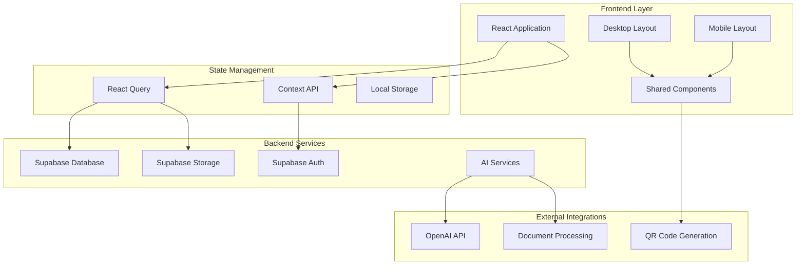

### Architecture Principles

1. **Component-Based Design**: Modular, reusable React components
2. **Separation of Concerns**: Clear distinction between UI, business logic, and data
3. **Responsive Design**: Adaptive layouts for desktop and mobile
4. **Progressive Enhancement**: Core functionality available without advanced features
5. **Security-First**: Authentication and authorization at every layer

---

## Technology Stack

### Frontend Technologies

- **React 18.3.1**: Core UI framework with hooks and functional components
- **TypeScript**: Type-safe development with comprehensive type definitions
- **Tailwind CSS**: Utility-first CSS framework for responsive design
- **Shadcn/UI**: High-quality component library built on Radix UI primitives
- **Lucide React**: Icon library for consistent visual elements
- **React Router DOM**: Client-side routing and navigation
- **React Query (TanStack)**: Server state management and caching

### Backend & Infrastructure

- **Supabase**: Backend-as-a-Service providing database, auth, and storage
- **PostgreSQL**: Relational database with advanced features
- **Row Level Security (RLS)**: Database-level authorization
- **Real-time Subscriptions**: Live data updates across clients

### Development Tools

- **Vite**: Fast build tool and development server
- **ESLint**: Code linting and quality enforcement
- **Bun**: Package manager and runtime

---

## Application Structure

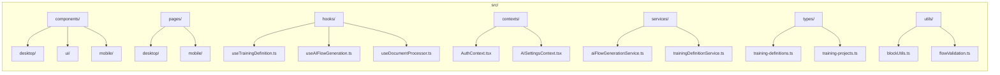

### Directory Structure Explanation

- **components/**: Reusable UI components organized by platform (desktop/mobile)
- **pages/**: Route-level components representing full pages
- **hooks/**: Custom React hooks for business logic and state management
- **contexts/**: React context providers for global state
- **services/**: API services and external integrations
- **types/**: TypeScript type definitions
- **utils/**: Pure utility functions and helpers

---

## Core Features

### 1. Training Definition Builder

The training definition builder is the core feature allowing users to create interactive training flows.

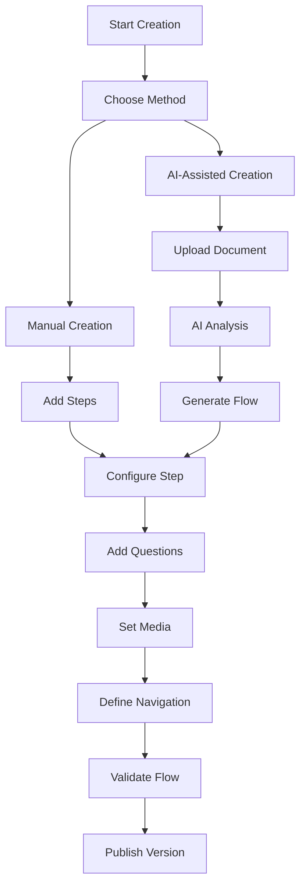

**Key Components:**
- `TrainingDefinitionBuilderMinimal`: Main builder interface
- `FlowCanvas`: Visual flow editor with drag-and-drop
- `BlockPalette`: Available step types and components
- `AIFlowGenerator`: AI-powered content generation

### 2. Training Projects

Projects represent deployments of training definitions to specific contexts.

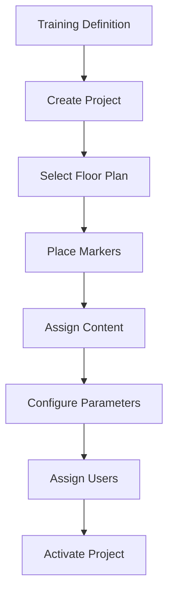

**Features:**
- Floor plan integration with interactive markers
- User assignment and progress tracking
- Real-time collaboration
- Content versioning and updates

### 3. Document Management (Oppr Docs)

Centralized document storage and processing system.

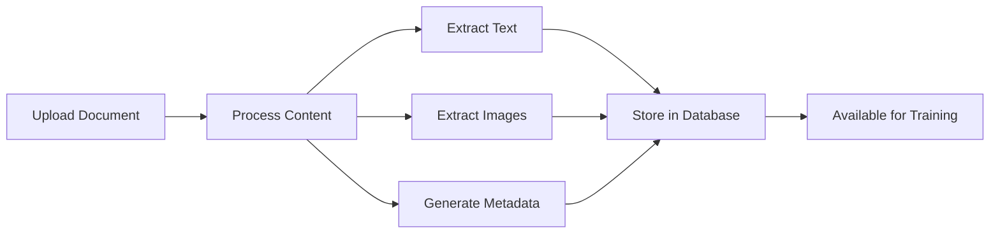

**Capabilities:**
- Multi-format document support (PDF, DOC, images)
- OCR text extraction
- Folder organization
- Bulk upload and management
- Search and filtering

### 4. AI Integration

AI-powered features for training content generation and analysis.

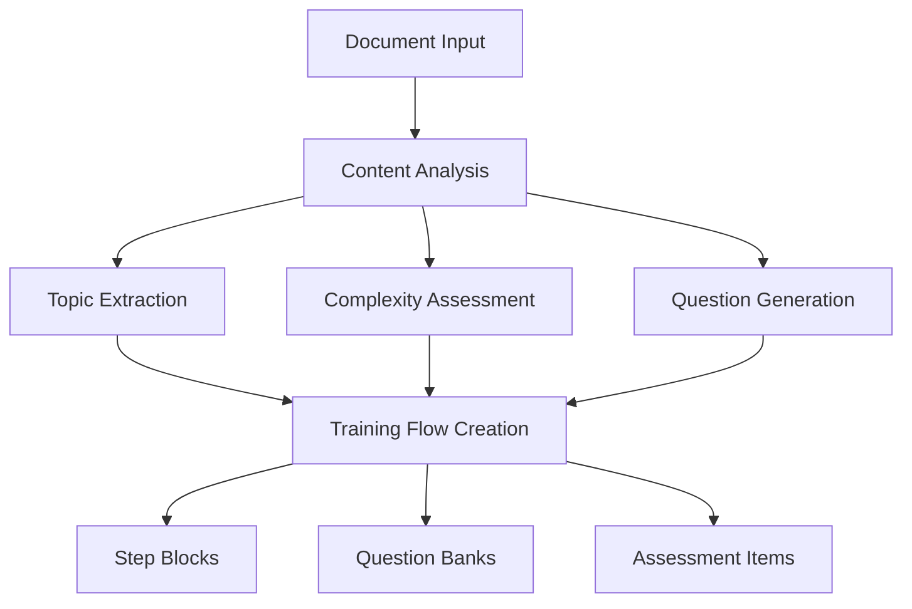

**AI Services:**
- Document analysis and summarization
- Automatic question generation
- Training flow optimization
- Content difficulty assessment

---

## Database Schema

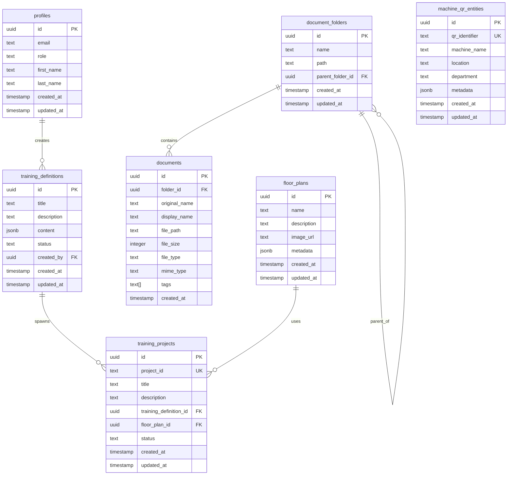

### Key Relationships

1. **User Management**: Profiles serve as the central user entity
2. **Content Hierarchy**: Training definitions spawn multiple projects
3. **Document Organization**: Hierarchical folder structure with documents
4. **Physical Integration**: Floor plans and QR entities for spatial training
5. **Audit Trail**: Comprehensive timestamping and user tracking

---

## Authentication & Authorization

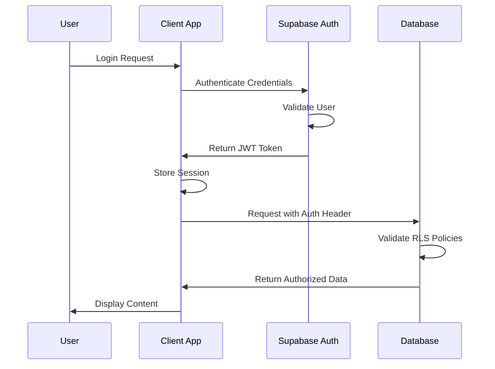

### Role-Based Access Control

- **Admin**: Full system access and user management
- **Manager**: Training creation and project management
- **Operator**: Training consumption and progress tracking
- **Viewer**: Read-only access to assigned content

### Row Level Security Policies

- Users can only access their own profile data
- Training definitions visible based on creator and sharing settings
- Project access controlled by assignment and role
- Document access governed by folder permissions

---

## File Management

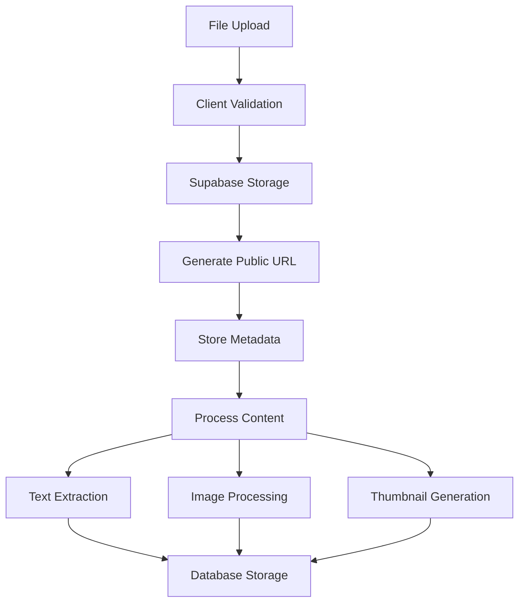

### Supported File Types

- **Documents**: PDF, DOC, DOCX, TXT
- **Images**: JPG, PNG, GIF, SVG
- **Presentations**: PPT, PPTX
- **Spreadsheets**: XLS, XLSX

### Storage Strategy

- Files stored in Supabase Storage buckets
- Metadata and extracted content in PostgreSQL
- CDN distribution for optimal performance
- Automatic backup and versioning

---

## AI Integration

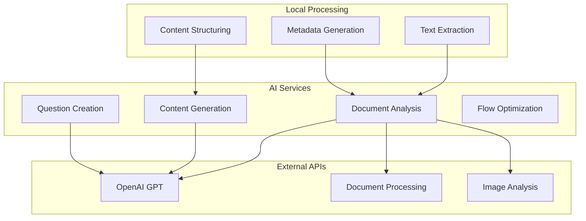

### AI Capabilities

1. **Document Analysis**
   - Content summarization
   - Topic extraction
   - Complexity assessment
   - Key concept identification

2. **Training Generation**
   - Automatic step creation
   - Question generation
   - Assessment design
   - Progress tracking setup

3. **Content Optimization**
   - Learning path optimization
   - Difficulty progression
   - Engagement enhancement
   - Personalization recommendations

---

## Development Setup

### Prerequisites

- Node.js 18+ or Bun runtime
- Git for version control
- Supabase account and project

### Installation Steps

```bash
# Clone repository
git clone <repository-url>
cd oppr-training-platform

# Install dependencies
bun install

# Set up environment variables
cp .env.example .env.local
# Edit .env.local with your Supabase credentials

# Start development server
bun dev
```

### Environment Variables

```env
VITE_SUPABASE_URL=your_supabase_url
VITE_SUPABASE_ANON_KEY=your_supabase_anon_key
VITE_OPENAI_API_KEY=your_openai_api_key
```

### Development Workflow

1. **Feature Development**: Create feature branches from main
2. **Code Quality**: ESLint and TypeScript checking
3. **Component Testing**: Isolated component development
4. **Integration Testing**: Full workflow validation
5. **Performance Monitoring**: Bundle size and runtime optimization

---

## Deployment Guide

### Production Build

```bash
# Build for production
bun run build

# Preview production build
bun run preview
```

### Supabase Configuration

1. **Database Setup**: Run migration scripts
2. **Storage Buckets**: Configure file storage
3. **Auth Settings**: Set up authentication providers
4. **RLS Policies**: Apply security policies
5. **Functions**: Deploy edge functions if needed

### Performance Optimization

- Code splitting for reduced bundle size
- Image optimization and lazy loading
- Caching strategies for API responses
- CDN configuration for static assets

---

## Security Considerations

### Data Protection

- End-to-end encryption for sensitive data
- Secure file upload and storage
- Input sanitization and validation
- XSS and CSRF protection

### Access Control

- JWT token-based authentication
- Role-based authorization
- Resource-level permissions
- Session management and timeout

### Compliance

- GDPR compliance for user data
- SOC 2 compliance through Supabase
- Regular security audits
- Incident response procedures

---

## API Reference

### Authentication Endpoints

```typescript
// Login
POST /auth/login
{
  email: string,
  password: string
}

// Register
POST /auth/register
{
  email: string,
  password: string,
  first_name: string,
  last_name: string,
  role: string
}
```

### Training Definitions API

```typescript
// Get all training definitions
GET /api/training-definitions

// Create training definition
POST /api/training-definitions
{
  title: string,
  description: string,
  content: StepBlock[]
}

// Update training definition
PUT /api/training-definitions/:id
{
  title?: string,
  description?: string,
  content?: StepBlock[]
}
```

### Document Management API

```typescript
// Upload document
POST /api/documents/upload
FormData: file, folder_id?, tags?

// Get documents
GET /api/documents?folder_id=uuid&search=string

// Process document
POST /api/documents/:id/process
```

---

## Component Architecture

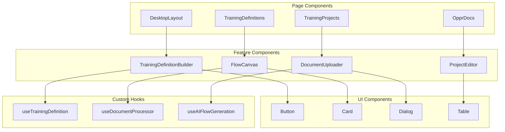

### Component Design Principles

1. **Single Responsibility**: Each component has one clear purpose
2. **Composition over Inheritance**: Build complex UIs from simple components
3. **Props Interface**: Clear, typed interfaces for component communication
4. **State Locality**: Keep state as close to usage as possible
5. **Performance Optimization**: Memoization and lazy loading where appropriate

---

## Performance Considerations

### Bundle Optimization

- Tree shaking for unused code elimination
- Dynamic imports for code splitting
- Lazy loading of routes and components
- Image optimization and format selection

### Runtime Performance

- React.memo for component memoization
- useMemo and useCallback for expensive operations
- Virtual scrolling for large lists
- Debounced search and filtering

### Network Optimization

- React Query for intelligent caching
- Batch API requests where possible
- Compression for file uploads
- CDN utilization for static assets

### Database Performance

- Efficient PostgreSQL queries
- Proper indexing strategy
- Connection pooling
- Query result caching

---

## Monitoring and Analytics

### Performance Monitoring

- Bundle size tracking
- Core Web Vitals monitoring
- Error boundary implementation
- User interaction analytics

### Business Metrics

- Training completion rates
- User engagement metrics
- Content effectiveness analysis
- System usage patterns

---

## Future Roadmap

### Planned Features

1. **Mobile App**: Native mobile application
2. **Offline Support**: Progressive Web App capabilities
3. **Advanced Analytics**: Learning analytics dashboard
4. **Integration APIs**: Third-party system integration
5. **White-label Solution**: Customizable branding options

### Technical Improvements

1. **Microservices Architecture**: Service decomposition
2. **Real-time Collaboration**: Multi-user editing
3. **Advanced AI**: Machine learning recommendations
4. **Scalability**: Horizontal scaling capabilities
5. **Internationalization**: Multi-language support

---

## Conclusion

The OPPR Training Platform represents a modern, scalable solution for industrial training management. Built with cutting-edge technologies and best practices, it provides a solid foundation for growth and adaptation to changing business needs.

The platform's modular architecture, comprehensive security model, and AI-powered features position it as a leader in the training technology space. With continued development and enhancement, it will continue to serve as an essential tool for organizations seeking to improve their training effectiveness and operational excellence.

---

*Document Version: 1.0*  
*Last Updated: December 2024*  
*Maintained by: OPPR Development Team*
